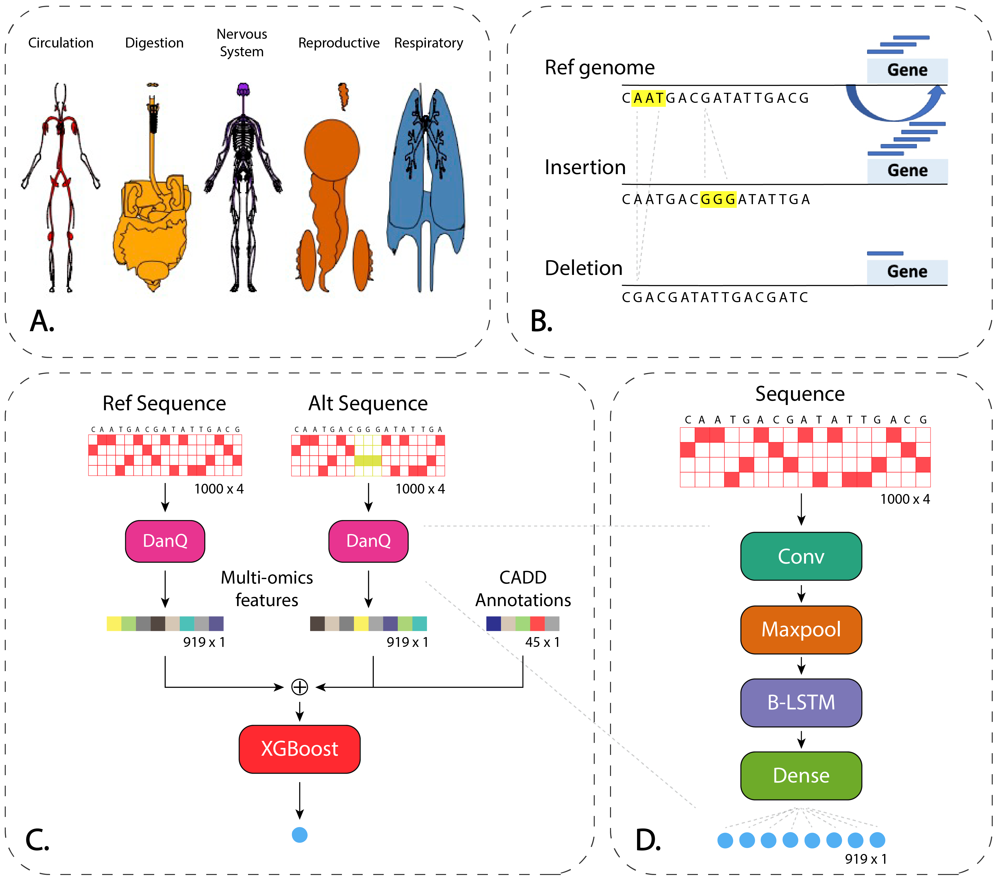

# TIVAN-Indel

By leveraging labeled Small Insertion and Deletion (sindel) that are highly potential in regulating gene expressions in GTEx, as well as a compilation of both generic functional annotations and tissue-specific functional annotations generated by sequence-based deep learning models, we developed TIVAN-Indel, which is an XGBoost-based supervised framework for scoring noncoding sindels based on their potential to regulate the nearby gene expressions. 

<p align="center"></p>
<p align="center">Figure 1. Overview of the TIVAN-Indel.</p>

## Requirements

TIVAN-Indel uses python `3.9.6` and xgboost `1.5.1`. The other requirements are:

```
h5py==3.1.0
matplotlib==3.4.3
numpy==1.19.3
numpy-utils==0.1.6
pandas==1.4.0
scikit-learn==0.24.2
tensorflow==2.6.0
```

## Usage

Download TIVAN-Indel

```bash
git clone https://github.com/amanbasu/TIVAN-indel.git
```

Install requirements

```bash
pip install -r requirements.txt
```

### DanQ model

The trained weights of DanQ model are provided in the `checkpoint/` directory, while the model code is present in `models/` directory. You can train your own model by using data from DeepSEA website (http://deepsea.princeton.edu/help/).

### Prepare training data

We use a compilation of both generic functional annotations and tissue-specific functional annotations generated by sequence-based deep learning models to train our TIVAN-indel model. The generic functional annotations are stored in `.trainingset.rda` files, which is a table of 45 annotation containing additional columns like 'RawScore' and 'PHRED' which are ignored. The 919 tissue-specific functional annotations are derived from a trained DanQ model. File `read_rda.r` reads the rda file and saves the annotation while `prepare_feature.py` file uses these annotations and combines them with other 919 features to create the input data for TIVAN-indel.

You can learn more about the script arguments using the `-h` command for individual files.

```
$ python prepare_feature.py -h
usage: prepare_feature.py [-h] [--path PATH] [--tissue TISSUE]

Arguments for preparing features.

optional arguments:
  -h, --help       show this help message and exit
  --path PATH      base path for input data
  --tissue TISSUE  tissue name
```

### Train TIVAN-indel model

The model architecture is described in Figure 1 (Part C). It uses a compilation of both generic functional annotations and tissue-specific functional annotations generated by sequence-based DanQ model for prediction. Use the below code to train models on specific tissues.

```bash
python train.py --train_tissue Whole_Blood --folds 5 --save_model True
```

### Predict

The TIVAN-indel model trained in the above section can be used to make predictions on new/unseen tissues. Use the below code to predict on new tissues.

```bash
python predict.py --train_tissue Whole_Blood --test_tissue CD4_NAIVE
```

## Obtain precomputed tissue-specific functional scores for query small indels

### R package installation
Two R packages "GenomicRanges" and "data.table" are required to retrieve tissue-specific functional scores for query small indels.

```r
if (!require("BiocManager", quietly = TRUE))
    install.packages("BiocManager")
BiocManager::install("GenomicRanges")
```

```r
install.packages("data.table")
```

All noncoding small indels in 1000 Genomes and the precomputed scores for 44 tissues/cell types in GTEX can be downloaded from [Here](https://drive.google.com/drive/folders/1fZ_V4_2sr-lPCa1HItXoUIvJ40qa_w_h?usp=share_link)

getscore.R could be downloaded [Here](https://github.com/lichen-lab/TIVAN-indel/blob/master/getscore.R)


